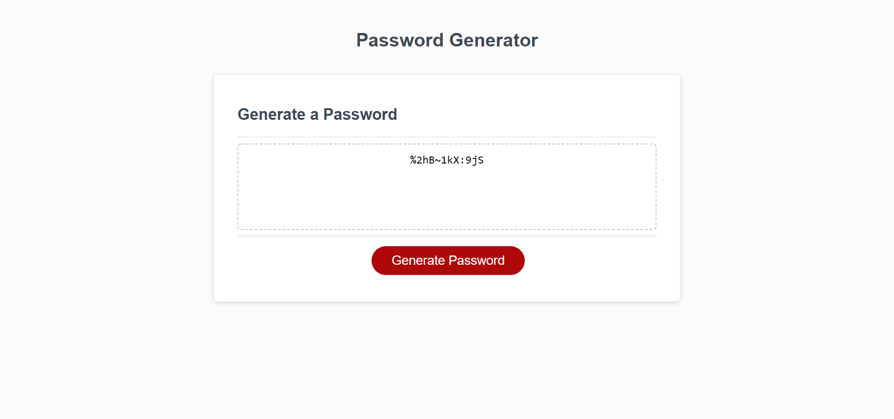
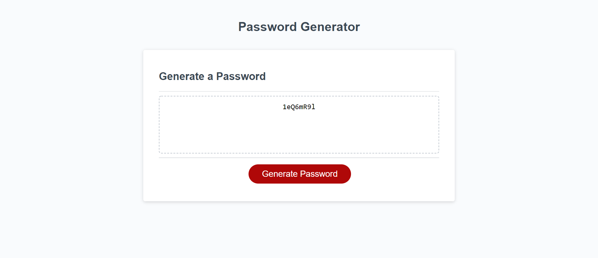

# Password Generator

# Application Does:
* This application can generate a password which is a combination of numbers, lowerCase, UpperCase and special characters based on the given length from the user.

# Technologies used:
* HTML, CSS, JavaScript

# Features:
* Button to generate a password.
* Range of Password.
* Accepting only Numbers.
* Choices of selecting password type among Special characters, Numbers, UpperCase Letters, LowerCase Letters.
* Criteria to select atleast one type of character.

# Challenges:
* Generating particular length of password
* Validations

# Sample web page

# Github Page 
https://vsatyakavya.github.io/PasswordGenerator.github.io/

# Github Repository
https://github.com/vsatyakavya/PasswordGenerator.github.io

# Contact information
satyakavya24@gmail.com

@copyright 2020
